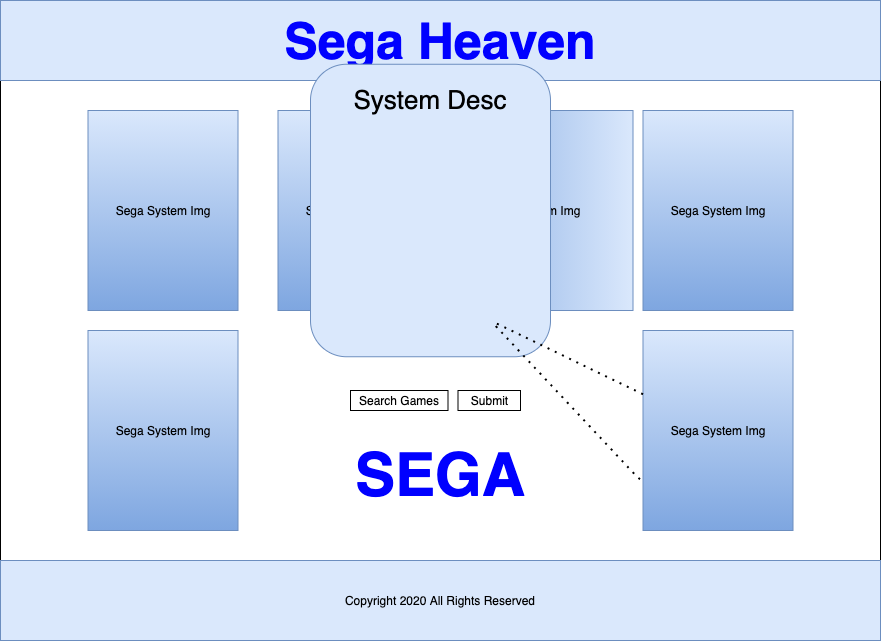

# **Sega Heaven**

A database search of Sega games for the 60th anniversery of the classic system maker. Brief history on each of their landmark systems included in the UI.

## Version 1.0
Current build includes:
- Game Database Search
- Interactive System Badges displaying historical description of each system
### Wireframe:

### Home Screenshot(s):

### Technologies
- HTML5
- CSS3
- JavaScript
- jQuery v3.5
- RAWG Video Games Database API (v1.0)

## Getting Started
https://sega-heaven.netlify.app/

### Future Versions to Include
- Smoother display for search results
- Improved Search parameters (.ie filters)
- Fix GPU spikes on additional browsers with animation